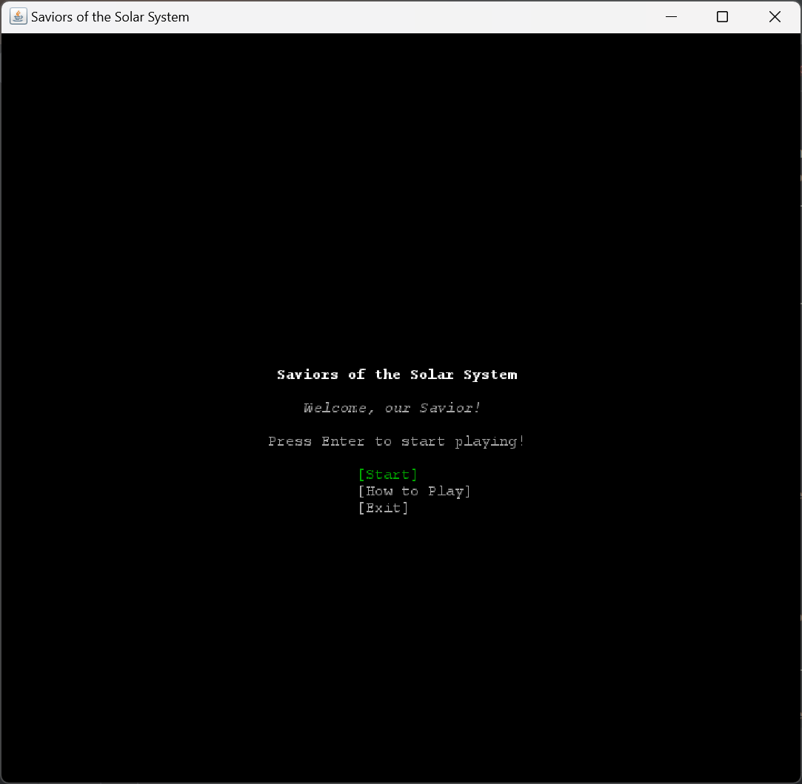
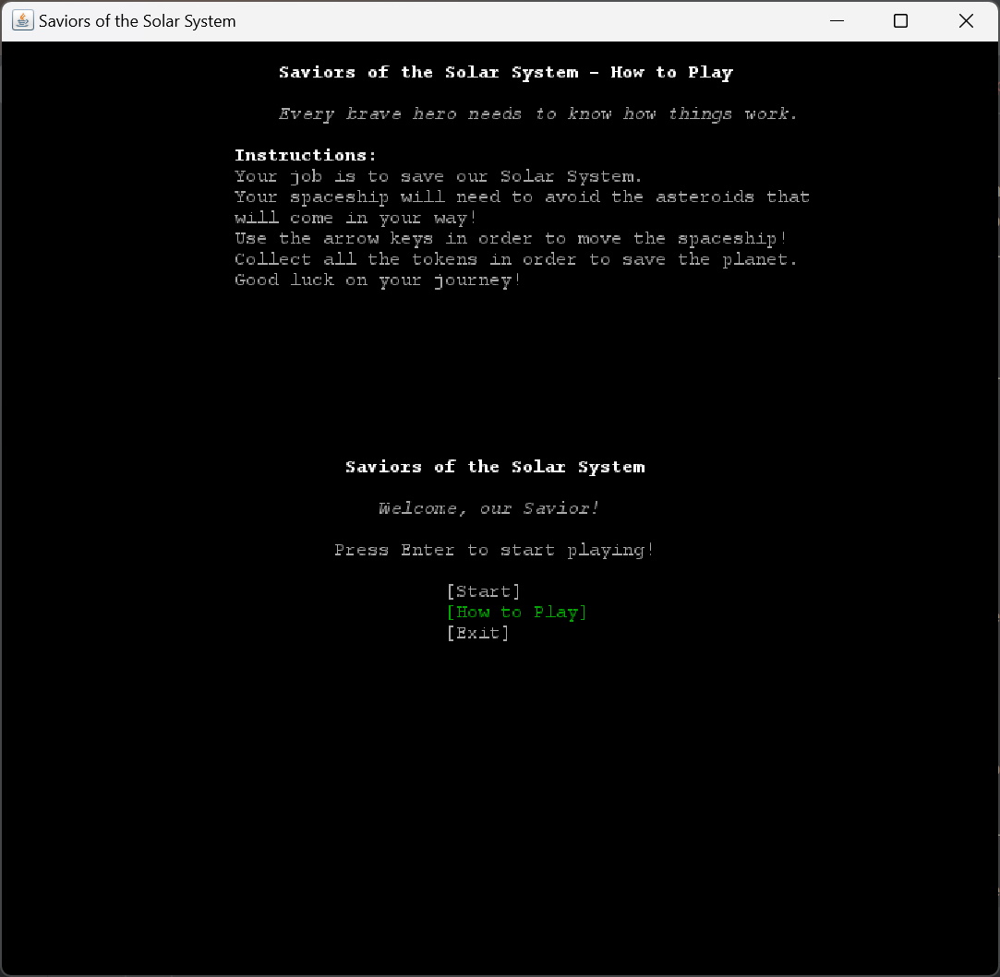
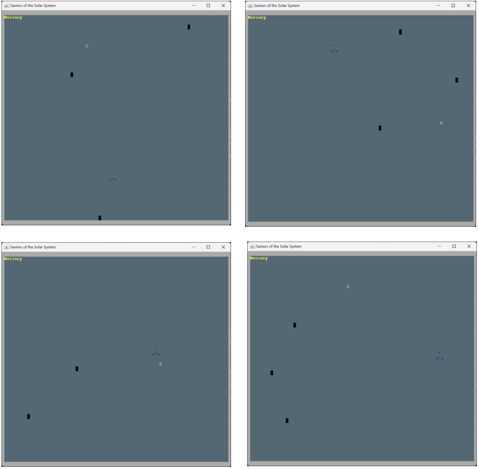

## LDTS_1101 - SAVIORS OF THE SOLAR SYSTEM

In this exciting adventure game you shall help the Saviors of the Universe save the solar system from a species of invaders that have the ability to control asteroids, by escaping the asteroids thrown by them and collecting all the tokens throughout the eight different levels (representing the eight planets of the solar system). In each level, until reaching the final level "com.ldts1101.sotss.Planet Earth" (which is the most difficult one), the difficulty level will increase. You will have more asteroids to dodge that will travel faster. You'll also have to collect more tokens to save the given planet. At the start you have 3 lives and for each planet you are able to save you'll receive an extra one. For every asteroid hit you lose one life. You can also catch special tokens that give you an extra life. Are you ready to save the solar system from the invaders?

How to play:
- #1 Run the program
- #2 Either start the game (press enter in "Start" button), visit the "How to Play" section (Instructions) (play afterward) or exit ("Exit" button).
- #3 Use the arrow keys (up, down, left, right) to dodge the asteroids and collect all the tokens to pass the level.
- #4 Have fun helping the Savior of the Galaxy save the Solar System.

This project was developed by Tiago Martins (up202206640@up.pt), Tiago Oliveira (up202009302@up.pt) and Álvaro Torres (up202208954@up.pt) for LDTS 2023⁄24.

Screenshots of the game:

