## LDTS_<11><01> - SAVIORS OF THE SOLAR SYSTEM

In this exciting adventure game you shall help the Saviors of the Universe save the solar system from a species of invaders that have the ability to control asteroids, by escaping the asteroids thrown by them and collecting all the tokens throughout the eight different levels (representing the eight planets of the solar system).
In each level, until reaching the final level "Planet Earth" (which is the most difficult one), the difficulty level will increase. You will have more asteroids to doge that will travel faster. You'll also have to collect more tokens to save the given planet. At the start you have 3 lives and for each planet you are able to save you'll receive an extra one. 
For every asteroid hit you lose one life.
You can also catch special tokens that give you an extra life.
Are you ready to save the solar system from the invaders?

This project was developed by Tiago Martins (up202206640@up.pt), Tiago Oliveira (up202009302@up.pt) and Álvaro Torres (up202208954@up.pt) for LDTS 2023⁄24.

### IMPLEMENTED FEATURES

> This section should contain a list of implemented features and their descriptions. In the end of the section, include two or three screenshots that illustrate the most important features.

- **Main Menu with** - "Start", "How to Play" (Instructions Menu) and "Exit" buttons (Esc key used to exit game when not in the Main Menu).

- **Spaceship movement** - The spaceship can move using the arrow keys (up, down, left, right).

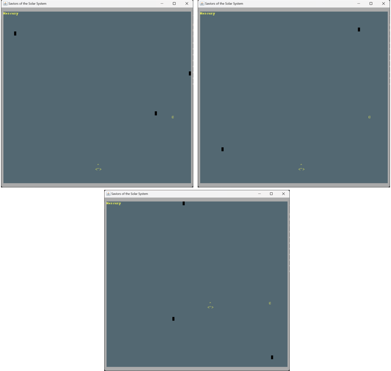

- **Asteroids movement** - Asteroids will move from top to bottom (vertically) randomly, one being created each second (for now). If there is a collision between the spaceship and one asteroid the user loses the game (for now).

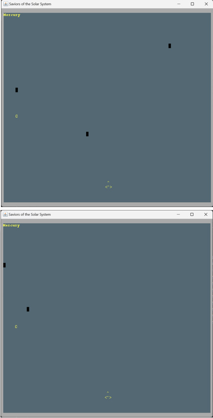

- **Tokens in each level** - Randomly generated tokens for each level that the user will be able to collect (next token appears when previous is collected).

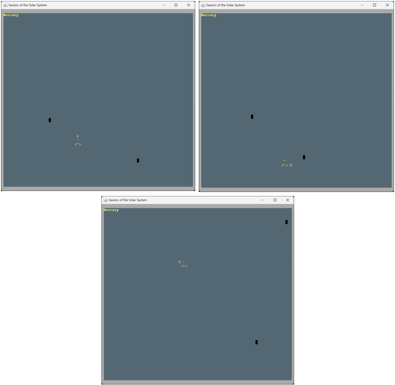

### PLANNED FEATURES

> This section is similar to the previous one but should list the features that are not yet implemented. Instead of screenshots you should include GUI mock-ups for the planned features.

We are going to implement the following features in the given order.

- **Increase difficulty by level** - For each level the user passes the difficulty will increase: more asteroids to doge that will travel faster + more tokens to collect to save the given planet (pass the level).

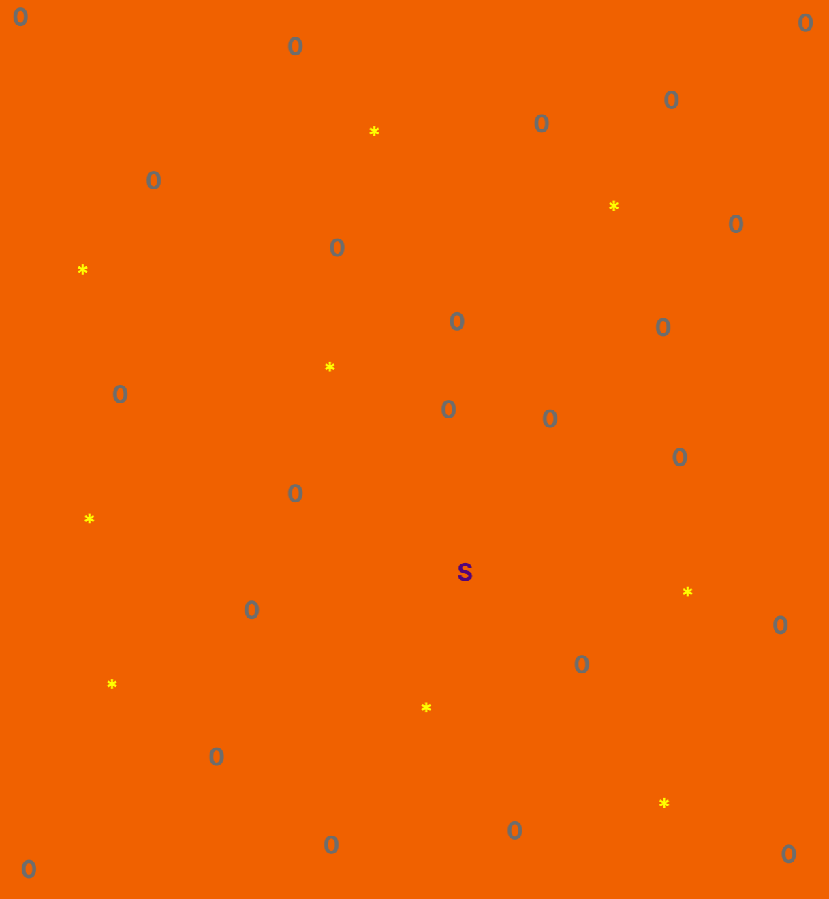

- **Lose lives** - Whenever the spaceship is hit by an asteroid it loses one life.

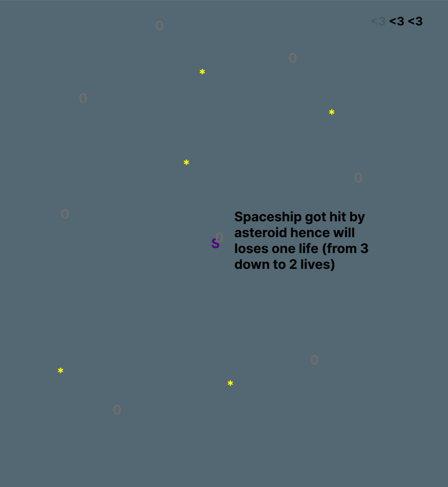

- **Win lives for passing level** - For each level the user passes it will receive one extra life.

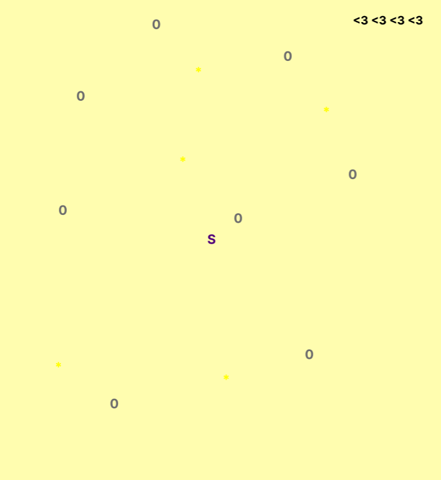

- **Extra lives that pop-up during game** - The user can catch special tokens that give an extra life.

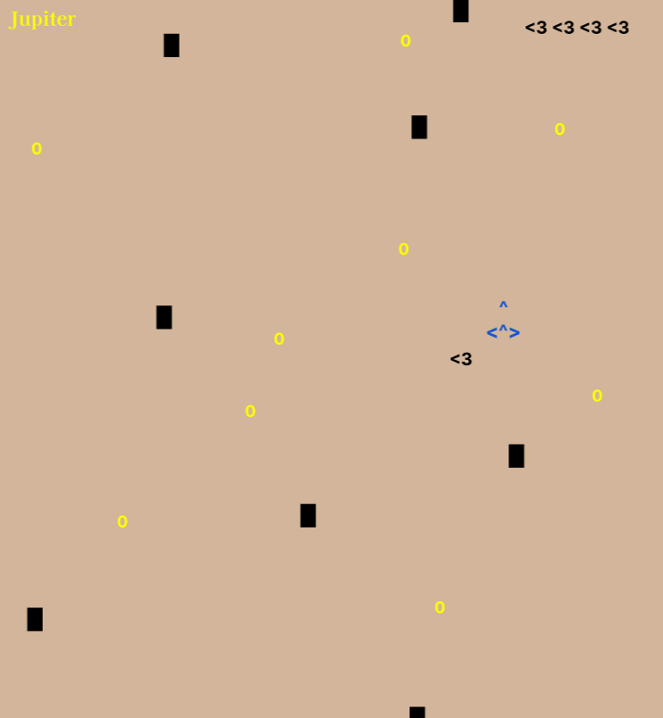

### DESIGN

> This section should be organized in different subsections, each describing a different design problem that you had to solve during the project. Each subsection should be organized in four different parts:

- **Problem in Context.** The description of the design context and the concrete problem that motivated the instantiation of the pattern. Someone else other than the original developer should be able to read and understand all the motivations for the decisions made. When refering to the implementation before the pattern was applied, don’t forget to [link to the relevant lines of code](https://help.github.com/en/articles/creating-a-permanent-link-to-a-code-snippet) in the appropriate version.
- **The Pattern.** Identify the design pattern to be applied, why it was selected and how it is a good fit considering the existing design context and the problem at hand.
- **Implementation.** Show how the pattern roles, operations and associations were mapped to the concrete design classes. Illustrate it with a UML class diagram, and refer to the corresponding source code with links to the relevant lines (these should be [relative links](https://help.github.com/en/articles/about-readmes#relative-links-and-image-paths-in-readme-files). When doing this, always point to the latest version of the code.
- **Consequences.** Benefits and liabilities of the design after the pattern instantiation, eventually comparing these consequences with those of alternative solutions.

**Example of one of such subsections**:

------

#### EACH PLANET IS DIFFERENT BUT HAS THE SAME BASIS

**Problem in Context**

Every planet that represents a level of the game (there are eight different ones) has the same basis as all planets. The constructor for a planet has a backgroundColor, name, tokenCount and an asteroidCount. Every concrete planet is different in all these fields.

**The Pattern**

We have applied the **Factory-Method** pattern. This pattern allows you to define an interface for creating the Planet object (Planet class), but let the subclasses (concrete planets) decide which class to instantiate. We decided to use this design pattern so that we could generalize the Planet class once we had eight different concrete planets tha shall be created, thus when running the game it will only need to access the concrete planets it needs, enabling a flexible and decoupled object creation process. The responsibility knowing what implementation of planet to create is delegated to the several subclasses, so to change the concrete planet that is created we only need to change one class.

**Implementation**

The following diagrams shows how the creator (Game class), the product (Planet class), the concrete creators (subclasses of Planet) and the concrete products (concrete planets) interact with each other. 

- UML dependencies diagram:
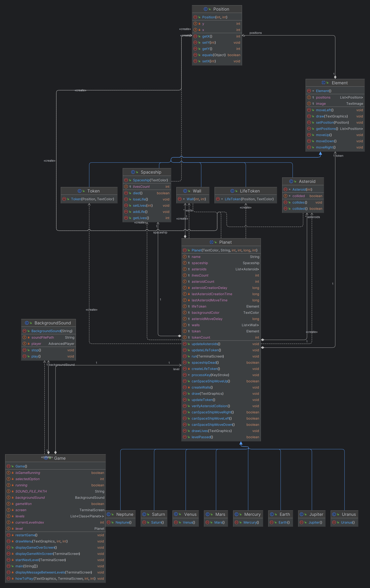

- UML classes diagram:
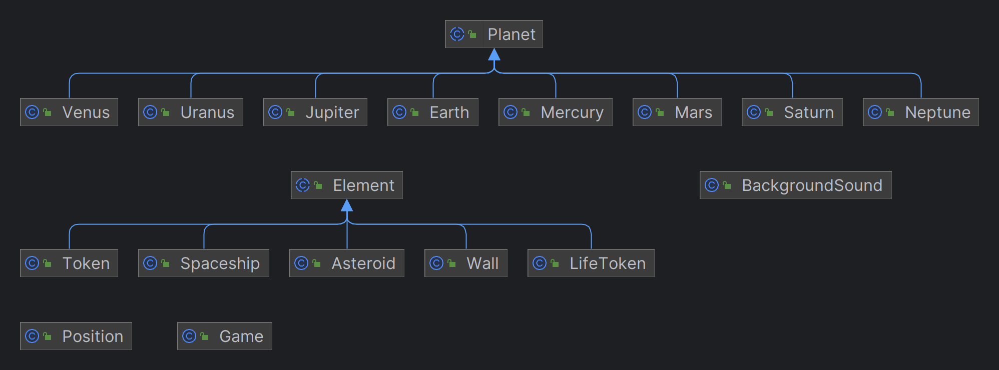

- Full UML classes diagram of game implementation:
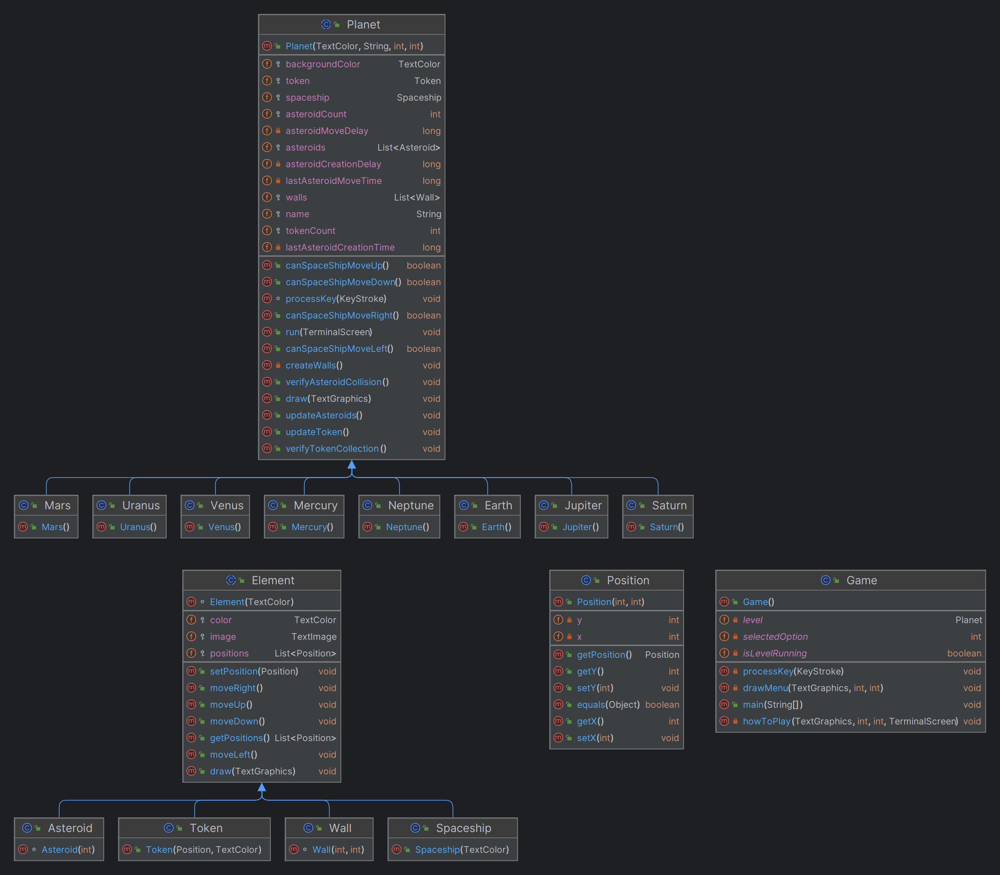

These classes can be found in the following files:

- [Game](src/main/java/Game.java)
- [Planet](src/main/java/Planet.java)
- [Mercury](src/main/java/Mercury.java)

**Consequences**

The use of the Factory-Method Pattern in the current design allows the following benefits:

- It eliminates the need to bind application-specific classes into our code.
- The code only needs to deal with the Planet class that is the product interface.
- Hence it can work with any concrete planet that is created (concrete product).
- When running the game it will only need to access the concrete planets it needs, enabling a flexible and decoupled object creation process

#### KNOWN CODE SMELLS

> This section should describe 3 to 5 different code smells that you have identified in your current implementation.

When the user opens the instructions in the main menu it cannot play the game without exiting it first and then re-running it.

### TESTING

- Screenshot of coverage report.

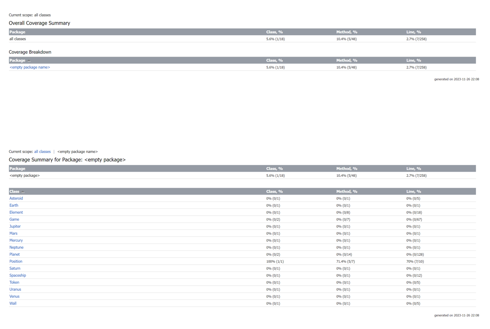

- Link to mutation testing report.

### SELF-EVALUATION

- Tiago Martins: 33%
- Tiago Oliveira: 33%
- Álvaro Torres: 33%