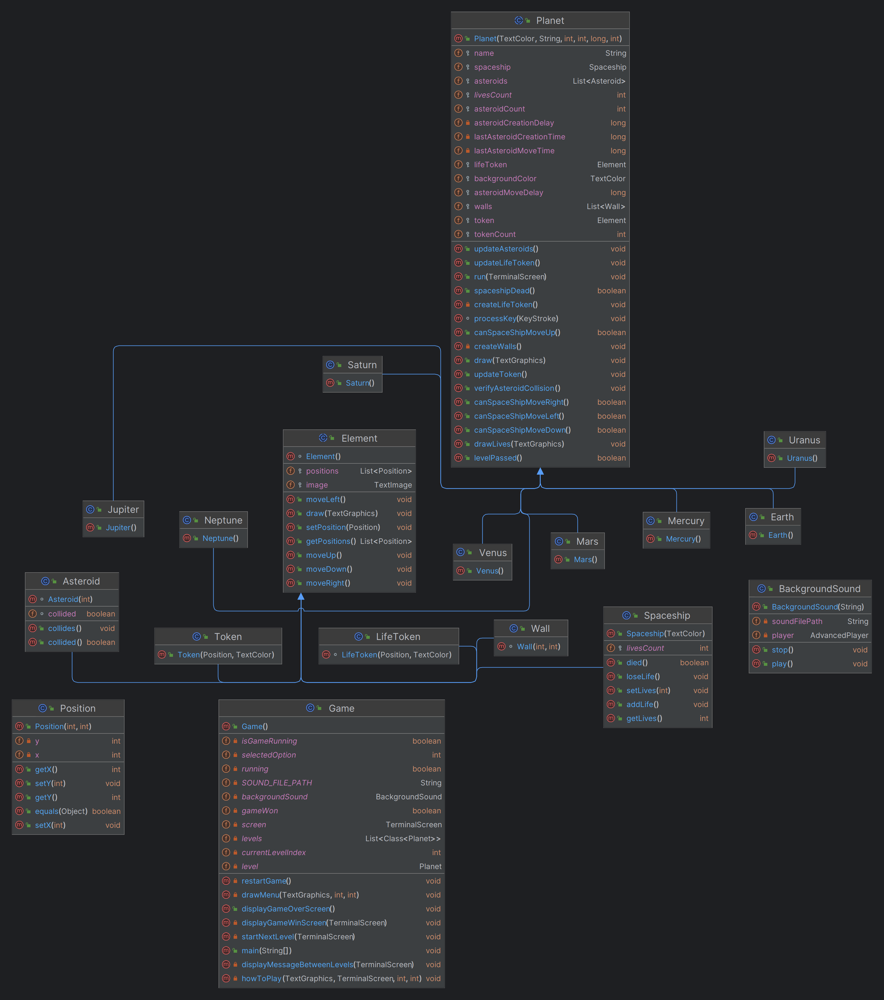

# LDTS_1101 - Saviors of the Solar System

## GAME DESCRIPTION

In this exciting adventure game you shall help the Saviors of the Universe save the Solar System from a species of invaders that have the ability to control asteroids, by avoiding the asteroids thrown by them and collecting all the tokens throughout the eight different levels (representing the eight planets of the solar system).
In each level, until reaching the final level "Earth" (which is the most difficult one), the difficulty level will increase. You will have more asteroids to dodge that will travel faster. You'll also have to collect more tokens to save the given planet. At the start of each level you have 3 lives (even if you lose lives during a level they are reset to 3 at the start of a new level). 
For every asteroid hit you lose one life.
You can also collect special tokens that give you an extra life.
Are you ready to save the Solar System from the invaders?

How to play:
- #1 Run the program
- #2 Either start the game (press enter in "Start" button), visit the "How to Play" section (Instructions) (play afterward) or exit ("Exit" button).
- #3 Use the arrow keys (up, down, left, right) to dodge the asteroids and collect all the tokens to pass the level.
- #4 Have fun helping the Saviors of the Universe save the Solar System.

This project was developed by Tiago Martins (up202206640@up.pt), Tiago Oliveira (up202009302@up.pt) and Álvaro Torres (up202208954@up.pt) for LDTS 2023⁄24.

## IMPLEMENTED FEATURES

- **Total of features:** 11
- **Total implemented features:** 11

## Features

- **Main Menu** - "Start", "How to Play" (Instructions Menu) and "Exit" buttons (ESCAPE key used to exit game when not in the Main Menu).

- **Spaceship movement** - The spaceship can move using the arrow keys (up, down, left, right).

- **Asteroids movement** - Asteroids will move from top to bottom (vertically) randomly. Depending on the level, the creation delay and move delay for the asteroids are different.

- **Tokens in each level** - Randomly generated tokens for each level that the user will be able to collect (next token appears when previous is collected).

- **Increase difficulty by level** - For each level the user passes the difficulty will increase: more asteroids to dodge that will travel faster (asteroid creation and move delay decreased) + more tokens to collect to save the given planet and pass to the next level.

- **Lose lives** - Whenever the spaceship is hit by an asteroid it loses one life. At first the player (spaceship) has 3 lives. The player can check the lives he has in the top-right corner of the screen.

- **Win lives for passing level** - For each level the user passes it will receive one extra life. We decided to de-implement this feature as it would make the game too easy. Instead, we opted for setting the number of lives (livesCount) to 3 for each level, even if lives are lost or won (via LifeToken) during a level, in the next level the livesCount is reset to 3, hence increasing the difficulty of the game.

- **Extra lives that pop-up during game** - The user can catch special tokens that give an extra life, that is "usable" during the level in which it was collected. The Life tokens appear after one normal token is collected and have a 5% chance of appearing. If you don't catch one of those tokens right away after it appears, and instead you go collect a normal token, there's a chance that the given LifeToken disappears and a new one is created in another position, thus increasing the difficulty of collecting it.

- **Level transition** - The game is composed of eight levels (each one represents one planet of the Solar System). There are intermediary screens between the various levels. If the player presses Enter while in one of those tabs the next level starts. Note that it is not able to end the program/quit the game when in these intermediary screens. You either go to the next level and then quit there or you die trying to save a given planet. There is no going back during the trips from one planet to another. You shall always fight the invaders or die trying :)

- **Game Over and Win Screens** - If the player loses, then a Game Over screen appears. If ENTER is pressed the game restarts (at the first level), if ESCAPE is pressed the program ends. When the player wins the game (passes level "Earth"), then a Win screen appears that has the same functionality as the Game Over tab.

- **Background music** - During the whole execution of the program the player will listen to the epic music "Cornfield Chase" from the soundtrack (Hans Zimmer) from the "Interstellar" movie. This will make the gameplay epic and excitingly thrilling.

**In-game screenshots that illustrate the major features of the game:**

- Menus:

Main Menu

Instructions (How to Play) Menu:

- Gameplay:

Level Mercury (first level):

Level Saturn (fourth level):

Level Mars (seventh level):

Level Earth (eight and last level):

- Intermediary Screen:

- Game Over and Win Screens:

Game Over Screen:

Win Screen:

## PLANNED FEATURES

All planned features where successfully implemented for final delivery.

## DESIGN PATTERNS

- UML classes diagram:

  

- Full UML classes diagram of the project:

  

- Full UML classes diagram with dependencies:

  

### EACH PLANET IS DIFFERENT BUT HAS THE SAME BASIS

**Problem in Context**

Every planet that represents a level of the game (there are eight different ones) has the same basis as all planets. The constructor for a planet has a backgroundColor, name, tokenCount, an asteroidCount, an asteroidDelay and a livesCount. Every concrete planet is different in all these fields (except for the livesCount field).

**The Pattern**

We have applied the **Factory-Method** pattern. This pattern allows you to define an interface for creating the planet object (planet class), but let the subclasses (concrete planets) decide which class to instantiate. We decided to use this design pattern so that we could generalize the planet class once we had eight different concrete planets tha shall be created, thus when running the game it will only need to access the concrete planets it needs, enabling a flexible and decoupled object creation process. The responsibility of knowing what implementation of planet to create is delegated to the several subclasses, so to change the concrete planet that is created we only need to change one class.

**Implementation**

The following diagrams shows how the creator (Game class), the product (Planet class), the concrete creators (subclasses of planet) and the concrete products (concrete planets) interact with each other. 

- UML classes diagram:

- Full UML classes diagram of game implementation:

- Full UML classes diagram with dependencies:

These classes can be found in the following files:

- [Game](Files/Game.java)
- [Planet](Files/Planet.java)
- [Mercury](Files/Mercury.java)

**Consequences**

The use of the Factory-Method Pattern in the current design allows the following benefits:

- It eliminates the need to bind application-specific classes into our code.
- The code only needs to deal with the planet class that is the product interface.
- Hence, it can work with any concrete planet that is created (concrete product).
- When running the game it will only need to access the concrete planets it needs, enabling a flexible and decoupled object creation process

### OTHER DESIGN ASPECTS
We intended to implement the Singleton Pattern that is partially present via the only instance of the Game class that exists during the program execution.
We also intended to implement the MVC architectural pattern in our project. Our goal was first and foremost to have a solid and functional final product, only then would we think about implementing the MVC architectural pattern. Unfortunately we didn't have the time to implement it into our project.

## ERROR-PRONE WARNINGS

We corrected some of the error-prone warnings of the code. Nonetheless, there are some that in our opinion, according to our implementation, aren't relevant, so we suppressed them. Here are the respective justifications for the suppressions of the most important error-prone warnings present in our code:

src\main\java\com\ldts1101\sotss\Position.java:31: 
error: [EqualsHashCode] Classes that override equals should also override hashCode.
public boolean equals(Object o) {

Justification: We didn't find it relevant to override the hashCode because when we use the equals method we don't store the object that is used in a collection afterward, so no broken behaviour shall arise.

src\main\java\com\ldts1101\sotss\Planet.java:171: 
warning: [MissingCasesInEnumSwitch] Non-exhaustive switch; either add a default or handle the remaining cases: Character, Escape, Backspace, and 32 others
switch(keyStroke.getKeyType()){

Justification: There is no need to define an action for Character, Escape, Backspace, and 32 others because they are not used.

src\main\java\com\ldts1101\sotss\Game.java:71: 
warning: [MissingCasesInEnumSwitch] Non-exhaustive switch; either add a default or handle the remaining cases: Character, Backspace, ArrowLeft, and 31 others
switch (keyStroke.getKeyType()) {

Justification: There is no need to define an action for Character, Backspace, ArrowLeft, and 31 others because they are not used.

src\main\java\com\ldts1101\sotss\Planet.java:36: 
warning: [StaticAssignmentInConstructor] This assignment is to a static field. Mutating static state from a constructor is highly error-prone.
this.livesCount = livesCount;

Justification: We kind of need to mutate static state from the "Planet" constructor because during a level the livesCount changes, either due to collisions with asteroids or due to the collection of LifeTokens. Even if in the beginning of each level the livesCount has the static value of 3 that value may change during each individual level. 

## CODE SMELLS

After the spaceship is hit by an asteroid (for example from above), if the spaceship is moved down against the same asteroid there is no hit registered (again). Each asteroid can only hit the spaceship once.

## TESTING

- Screenshot of coverage report.

 !substituir

- Link to mutation testing report.

!por + screenshot

## SELF-EVALUATION

The work was divided in a mutual way, and we all contributed with our best. It helped us to enrich our Java, design patterns and testing knowledge, as well as our team work.

- Tiago Martins: 33,33333333%
- Tiago Oliveira: 33,33333333%
- Álvaro Torres: 33,33333333%